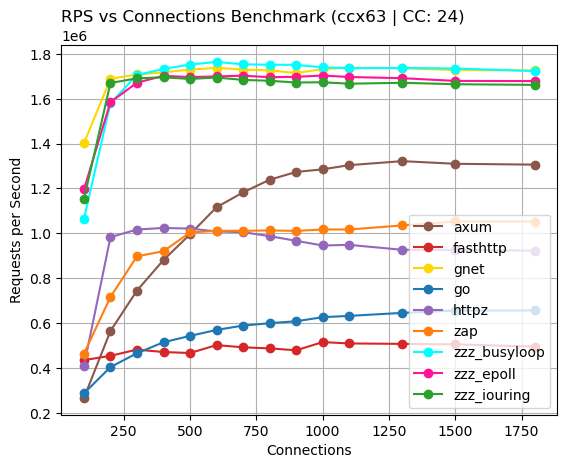
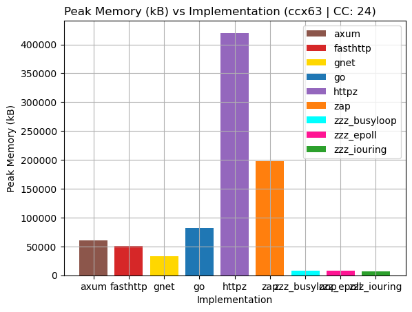

# zzz


## Installing
Tracking Latest Zig Stable: `0.13.0`
```
zig fetch --save git+https://github.com/mookums/zzz#main
```

You can then add the dependency in your `build.zig` file:
```zig
const zzz = b.dependency("zzz", .{
    .target = target,
    .optimize = optimize,
}).module("zzz");

exe.root_module.addImport(zzz);
```

## zzz?
zzz is a framework for writing performant and reliable networked services in Zig. It currently only supports TCP as the underlying transport layer and allows for any arbitrary protocol to run on top. It also natively supports TLS for securing connections.

zzz currently supports Linux, Mac and Windows. Linux is currently the only target supported for deployments.

> [!IMPORTANT]
> zzz is currently **alpha** software and there is still a lot changing at a fairly quick pace and certain places where things are less polished.

It focuses on modularity and portability, allowing you to swap in your own implementations for various things. Consumers can provide both a protocol and an async implementation, allowing for maximum flexibility. This allows for use in standard servers as well as embedded/bare metal domains.

For more information, look here:
1. [Getting Started](./docs/getting_started.md)
2. [HTTPS](./docs/https.md)
3. [Performance Tuning](./docs/performance.md)
4. [Custom Async](https://muki.gg/post/modular-async)

## Optimization
zzz is **very** fast. Through a combination of methods, such as allocation at start up and avoiding thread contention, we are able to extract tons of performance out of a fairly simple implementation. zzz is quite robust currently but is still early stage software. It's currently been running in production, serving my [site](https://muki.gg).

With the recent migration to [tardy](https://github.com/mookums/tardy), zzz is about as fast as gnet, the fastest plaintext HTTP server according to [TechEmpower](https://www.techempower.com/benchmarks/#hw=ph&test=plaintext&section=data-r22), while consuming only ~22% of the memory that gnet requires.



[Raw Data](./docs/benchmark/request_ccx63_24.csv)



[Raw Data](./docs/benchmark/memory_ccx63_24.csv)

On the CCX63 instance on Hetzner with 2000 max connections, we are 70.9% faster than [zap](https://github.com/zigzap/zap) and 83.8% faster than [http.zig](https://github.com/karlseguin/http.zig). We also utilize less memory, using only ~3% of the memory used by zap and ~1.6% of the memory used by http.zig.

zzz can be configured to utilize minimal memory while remaining performant. The provided `minram` example only uses 256 kB (using `io_uring` and musl)!

## Features
- Built on top of [Tardy](https://github.com/mookums/tardy), an asynchronous runtime.
- [Modular Asynchronous Implementation](https://muki.gg/post/modular-async)
    - `io_uring` for Linux (>= 5.1.0).
    - `epoll` for Linux (>= 2.5.45).
    - `busy_loop` for Linux, Mac and Windows.
- Modular Protocol Implementation
    - Allows for defining your own Protocol on top of TCP.
    - Comes with:
        - [HTTP/1.1](https://github.com/mookums/zzz/blob/main/src/http)
        - HTTP/2 (planned)
        - MQTT (planned)
- Single and Multi-threaded Support
- TLS using BearSSL
- (Almost) all memory allocated at startup

